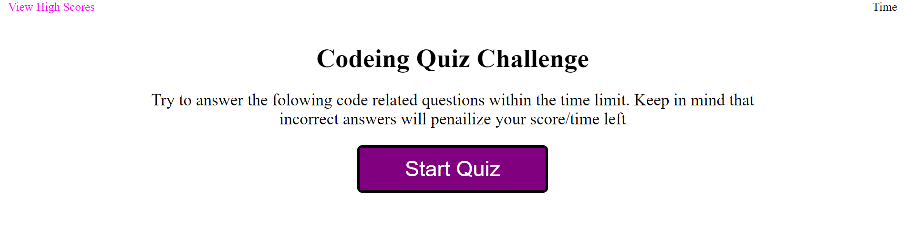

# <Code-Quiz>

## Description

    

## Installation
    Web Page is in the link below
[Code Quiz](https://neglon.github.io/codeing-quiz)

## Usage
    Upon visiting the page, you have a button to start the quiz or a link in the top left to go to the high scores.
    If you start the quiz you will be prompted with 5 mulitple choice question/answers one at a time. 
    Also upon starting a timer will begin counting down in the top right. Click on the answer you believe is correct.
    If wrong 15 seconds will be subtracted from the time remaining. 
    Once you finish or run out of time you will be presented with your score
    and an area to input you initials to log you highscore. 
    You will then be re-directed to another page where the high scores are displayed
   

   

   

## Credits
    N/A

## Liscence
    N/A

## Code Source
    Code fully written by Thomas Neylon, references were made to previous classwork, mdn webdocs, w3 schools, and stack overflow.

[Uconn FSF Gitlab](https://git.bootcampcontent.com/University-of-Connecticut/CONN-VIRT-FSF-PT-11-2023-U-LOLC)
    
[MDN](https://developer.mozilla.org/en-US/docs/Web/JavaScript/Reference/Global_Objects/Array/sort)
    
[Stack Overflow](https://stackoverflow.com/questions/15838481/multiple-html-files-linked-to-only-one-javascript-file)

[W3 Schools](https://www.w3schools.com/js/js_window_location.asp)

[W3 JSON](https://www.w3schools.com/js/js_json_intro.asp)

[W3 Nodes](https://www.w3schools.com/js/js_htmldom_nodes.asp)

[W3 Local Storage](https://www.w3schools.com/jsref/prop_win_localstorage.asp)

